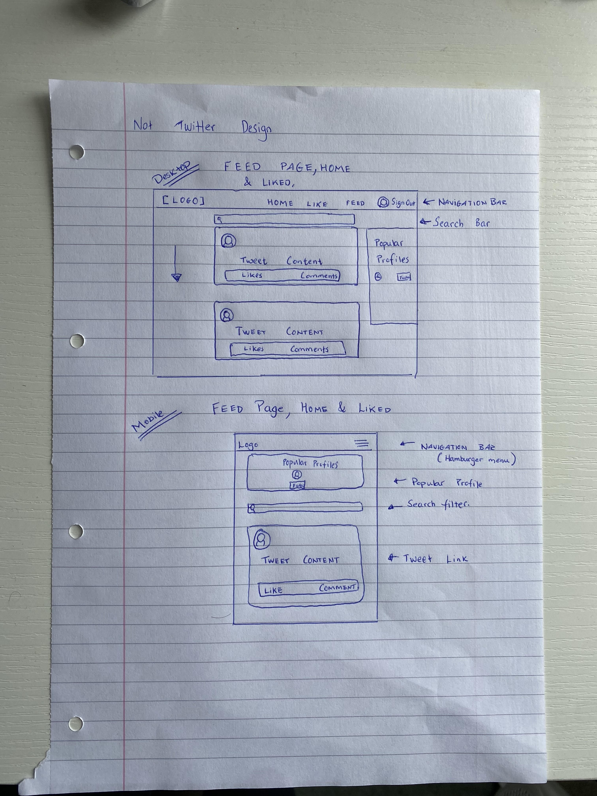
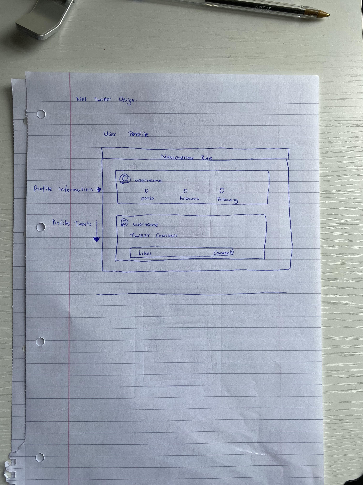
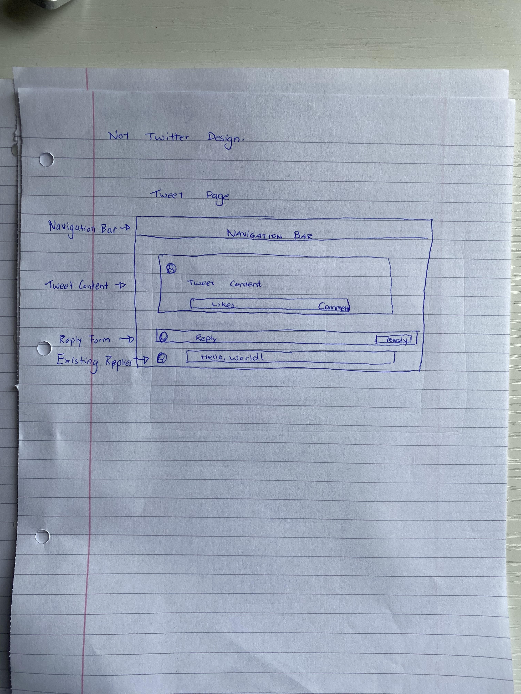

# Twitter Clone

A simple Twitter Clone built with Django Rest Framework, React, and Tailwind CSS, hosted on Heroku.

## Features

- User registration and authentication.
- Full CRUD functionality.
  - Create posts
  - Read posts
  - Update posts
  - Delete posts
- Responsive design for use across all devices.
- The ability to follow/unfollow users.
- The ability to view posts by accounts you follow
- The ability to like/unlike posts.
- The ability to view all liked posts.

### Features to add.

- Edit profile.
  - currently, users are unable to edit their current profile pictures or bio (content)

---

## User Stories.

| as a                            | I want to                                               | so that I can                                      | components                                         |
| ------------------------------- | ------------------------------------------------------- | -------------------------------------------------- | -------------------------------------------------- |
| user                            | sign up for an account                                  | start sharing my thoughts and follow others        | SignUpForm.js, PopularAccounts.js, AccountPage.js. |
| user                            | navigate through all pages quickly                      | I can browse seamlessly without page refresh       | NavBar.js, DropDownMenu.js.                        |
| user                            |  post a comment under a tweet                           | I can share my opinion under tweets                | Replies.js, ReplyForm.js                           |
| user                            | follow and unfollow users                               | and remove tweets from my feed.                    | Utils.js, PopularAccounts.js, AccountPage.js.      |
| user                            | edit and delete my replies                              | if I want to edit or remove replies, I can         | EditDeleteDropDown.js, ReplyEditForm.js            |
|  registered user                | log in and out                                          | I can access my account securely                   | NavBar.js, SignInForm.js                           |
| user                            | edit my tweet                                           | I can correct any errors and change the content    | EditTweetForm.js, TweetPage.js                     |
| user                            | View other users’ profiles                              | I can learn more about them                        | AccountPage.js                                     |
| user                            | maintain my logged-in status until I choose to log out  | my user experience is not compromised              | Navbar.js                                          |
| user                            |  post tweets & images                                   |  I can share content with everyone on the platform | TweetCreateFrom.js, Tweet.js, FeedPage.js          |
| user                            |  I can like and unlike posts                            | I can view all my favorite posts                   | Tweet.js, FeedPage.js                              |
| user                            | I can view the most recent posts                        | I can be up to date-on posts                       | FeedPage.js                                        |
| user                            | I can scroll indefinitely as posts are loaded           | so that I do not have to click on 'next page'      | FeedPage.js,                                       |
| user  I can learn more about it | I can view individual posts                             | I can learn more about it                          | TweetPage.js                                       |
|  user                           |  I can view a list of the most popular profiles         | I can check out the popular profiles               | FeedPage.js                                        |
| User                            | I can search for keywords                               | I can find posts that I'm interested in            | FeedPage.js                                        |

---

## Front End Libraries.

### Tailwind CSS.

Tailwind CSS allowed me to code the front end quickly and efficiently. Making the design responsive was easy with Tailwind's responsive utility classes.

Tailwind allows for faster design of the front end, essentially nullifying the need for creating vanilla CSS files.

- The documentation for Tailwind CSS can be found [here](https://tailwindcss.com/)

### React Icons

The React Icons library was used during the development of this project.

React Icons offers a wide range of free icons that can be styled and manipulated in the front end.

- The documentation for React Icons can be found [here](https://react-icons.github.io/react-icons/)

### React Router

This Twitter clone leverages React Router to handle navigation and routing within our application. React Router enables the creation of a single-page application experience, offering a smooth user journey without the need for full-page reloads.

- The documentation for react-router can be found [here](https://reactrouter.com/en/main)

### React Infinite Scroll Component

The use of infinite scroll in this project was to allow users to view content without pagination. This makes the app more modern & engaging.

- The documentation for react-infinite-scroll-component can be found [here.](https://www.npmjs.com/package/react-infinite-scroll-component)

### React Bootstrap.

React Bootstrap was used in some sections of this project. Particularly relating to forms.

- The documentation for React Bootstrap can be found [here](https://react-bootstrap.netlify.app/)

---

## Reusable React Components

### NavBar.js

The navigation bar is a key component of any good website. The navigation bar appears on every page of the website. Users can navigate easily from page to page.

This component is stateful which allows the contents of the navigation bar to be manipulated based on whether the user is currently logged in or if they have logged out.

The navigation bar is responsive. When the screen reaches the Tailwind’s medium (md) breakpoint, the links are displayed horizontally across the header.

When it is below the medium breakpoint, they are displayed in a ‘drop-down’ menu that slides in from the right of the screen.

### DropDownMenu.js

Instead of having a conditional render method within the NavBar.js file, I decided to take the hardcode of the dropdown out of the NavBar.js file. This made both elements easier to style while increasing the readability of the code.

The dropdown menu allows users to navigate through each page of the website while on smaller devices.

### Avatar.js

The avatar component allows me to render the user profile picture in the link to said user's profile. It allows for customisation by accepting source, height, and optional text.

This is an ideal component for this app but could be taken and used in any application that needs to display user profile pictures.

---

## Design process

### Home Page

The design process of NotTwitter was modeled after the design of twitter and some aspects of Instagram.

The home page, feed page and liked posts page were all modeled after the home page of twitter. With tweets centered in a vertical column, with some content aside (popular profiles). The search bar is also present above the tweets, making searching for content incredibly simple.

This design, along with infinte scroll allows for seemless scrolling through the apps content.

The the basis for design of the home page was this hand drawing I made after reviewing twitters feed.


### Profile Page

The profile page took inspiration from instagrams profile page. Meaning it should display the user profile picture, posts count, followers count and following count. The follow button should be displayed towards the bottom of the profile display.

The content of that users profile ( i.e the tweets ) took inspiration from twitters user profile deisgn.A vertical coloum of tweets displayed one on top of the other. (As oppose to instagrams grid display)

This design clearly displays the profiles information and allows scrolling through their profile.

This is the hand-drawing I made of the profile design.


### Tweet Page

The design of the tweet display took inspiration from both twiiter and instagrams post display. The users post, like counts and comment count followed by the comments benneath the post.

This design shows the intended tweet as the primary piece and also allows scrolling through the comments. 

The is the hand drawn design I made for the Tweet page.


### Colour Theme

**Nighttime Color Theme:**
This project replicates Twitter's nighttime color theme using Tailwind CSS. The color palette includes dark shades for background, text, links, and various components to create a visually appealing and immersive experience.

**Tailwind CSS Configuration:**
The project's Tailwind CSS configuration is defined in the `tailwind.config.js` file. The color scheme is customized using specific hexadecimal values for elements such as background, text, links, and more.

**Color Reference:**
To maintain consistency with Twitter's nighttime theme, key color variables are defined in the configuration file. For instance, background is set to `#141d26`, text color to `#ffffff`, and links to `#1da1f2`, providing a cohesive and familiar appearance to users.

## Manual Testing (Front-End)

---

Manual testing showed that users can:

### Create an account.

The tests ran for registering an account showed: - A user with a unique username and password could create an account as long as it meets the password criteria.

    - The username must be unique. If a user tries to create an account using the name 'Tom', and creates a password that matches the criteria, they will recieve a notfication saying 'A user with that username already exists.'

    - The passwords must match.
        - If a user has a unique user name but the passwords do not match, they will recieve an error message "The passwords do not match"

    - The password criteria.
        - If a password is entirely numerical, they will recieve a notfication of this error.
        - If the password lenght is less than 8, they will be notified of this.
        - If the password is too common they will be notified of this.

### Login/logout

    - Once a user has created an account, they are redirected to the sign in form.

    - Successful login.
        - If a user correctly adds their username and password they are directed to the feed page.

    - Wrong username/ username does not exist.
        - Error message displayed 'Unable to log in with provided credentials.'

    - Empty Fields.
        - Leaving the username field blank with a password input creates a notfication "Must include "username" and "password"."

        - Empty password fields results in this error message "This field may not be blank" appearing below the password field.

### Had a sustained login period

    - If a user logins in and returns to the site after 5 minutes, they will still be logged in. If the user is inactive after 24 hours, they will be logged out. This is the intended functionality.

### Follow/unfollow users

    - Users can follow other users by clicking the folow button on the popular profile component. Users can also follow other users by visiting their profile and clicking the follow button.

    Following a user:
        Popular Accounts:
            - Clicking on the follow button will dynamically update the button on the popular profiles to change to "Unfollow"
            - Visiting the clicked profile shows: An unfollow button is present. Their followers count has increased by one.
            - Visiting the logged in profile shows their following count has increased by one.

        Visiting Account:
            - When visiting another users profile ( which they are not already following ) the "Follow" button is present. Clicking on the button results in the "Unfollow" button appearing.
            - Their followers count will also increase by one.
            - Revisiting the logged in users account will show that their following count has increased by one.

    Unollowing a user:
        Popular Accounts:
            - Clicking on the unfollow button will dynamically update the button on the popular profiles to change to "Follow"
            - Visiting the clicked profile shows: An follow button is present showing that they have unfollowed the user. Their followers count has decreased by one.
            - Visiting the logged in profile shows their following count has decreased by one.

        Visiting Account:
            - When visiting another users profile ( which they are already following ) the "Unfollow" button is present. Clicking on the button results in the "Follow" button appearing.
            - Their followers count will also decrease by one.
            - Revisiting the logged in users account will show that their following count has decreased by one.

### Like/Unlike tweets

    - Liking Posts
        - Users can like tweets of other users. These tweets are then displayed the the liked page.

        - Liking a tweet will also increase the like count by one

        - Visitors to the site can not like tweets if they are not logged in to an account. When hovering over the like button, a message appears stating that they must log in to like a tweet.

        - Users can not like their own tweets.When hovering over the like button, a message appears stating that they can not like their own tweets.

    - Unliking Posts
        - Users can also unlike tweets. When a tweet is liked, the like button is colored, clicking on this will result in only the outline of like button. Unliking a tweet will remove the tweet from the liked tab.

        - Unliking the tweet will decrease the like count by one.

### Create tweets

    - Creating a tweet can be accomplished with the tweet create form.

    - The text field must be filled. If it empty, the message "This field may not be blank" will appear.

    - Image field may be blank, this is not required in the model.

    - A visitor which is not logged in can not create a tweet.

### Edit/delete tweets

    - Only the user who owns the account which created the tweet can edit it.

    - If you visit a tweet which does not belong to you or you are a logged out user, there will be no option to edit it.

    - When you own the tweet, a dropdown menu will be available which allows you to edit the tweet.

    - If the tweet did not contain an image intially, it can be added in this form.

    - The image can be changed by selecting a new file.

    - The text of the tweet can also be updated.

    - Only the owner of the tweet can delete it.

    - Deleting a tweet will remove it from the users profile.

### Reply to tweets

    - Only users who are logged in to an account can reply to posts.

    - The reply can only be edited by the owner of the reply.

    - The reply must not be blank.

### Edit/delete reply

    - Edit
        - The reply can only be edited by the owner of the reply. If you view a reply which was not posted by your account, or you are logged out, you will not be able to edit the reply.

        - If you are the owner of the account and you are logged in, the reply can be edited.

    - Delete
        - The reply can only be deleted by the owner of the reply. If you view a reply which was not posted by your account, or you are logged out, you will not be able to delete the reply.

        - If you are the owner of the account and you are logged in, the reply can be deleted.

### Filter liked posts

    - Liking a post on the home page, then visiting the liked tweet page will show that the liked post will be present in your liked posts.

    - Unliking the posts you have previously liked will remove them from your liked posts. This shows that the filter is working.

### Search for keywords/users

    - Enter a character or word in the search tab, it will return all posts that contain that character or that word.

## Deployment (Heroku)

This application is hosted on Heroku.

To allow the development of the site, the deployment had to be co-ordinated with the REST API. Through development, I set the client orgin dev key to the current site that was created through gitpod.

The site has access to the API as the config vars include an Allowed Host which is set the deployed sites url. This is key as without this, the site would not have access to the API data.

Other configuartion variables are set in the heroku setting which allow image hosting and setting the database url.

The Heroku app was connected to my GitHub repository, (found [here](https://github.com/GavPri/twitter_front_end/tree/main)).

### In the settings tab…

- Add any necessary configuration variables that are required for the project to function.
  - Allowed host
  - Client orgin
  - Client orgin dev
  - Cloudinary url
  - database url
  - disable collect static.
  - secret key.

### In the deployment tab…

- Connect your GitHub repository.

- Scroll down the page to the deployment section and click ‘deploy branch’

---

### Cloning the Repository

If you haven't already, you can clone the repository using the following steps:

1. Open a terminal or command prompt.
2. Navigate to the directory where you want to clone the project.
3. Run the following command:

   ```bash
   git clone https://github.com/GavPri/twitter_front_end
   ```

4. Change into the project directory:

   ```bash
   cd twitter_front_end
   ```

## Forking the Repository

If you'd like to contribute to this project, it's recommended to fork the repository. Follow these steps:

1. On the top right of the GitHub page, click the "Fork" button.
2. This will create a copy of the repository in your GitHub account.
3. Clone your fork to your local machine using the instructions mentioned in the "Cloning the Repository" section.
4. Create a new branch for your changes:

   ```bash
   git checkout -b feature/your-feature-name
   ```

5. Make your changes and push them to your forked repository.
6. Open a pull request to merge your changes into the original repository.

### Credits.

The code in this project was created by closely following the course content of Code Institute. In particular, the moments repository, which can be found [here](https://github.com/mr-fibonacci/moments)
